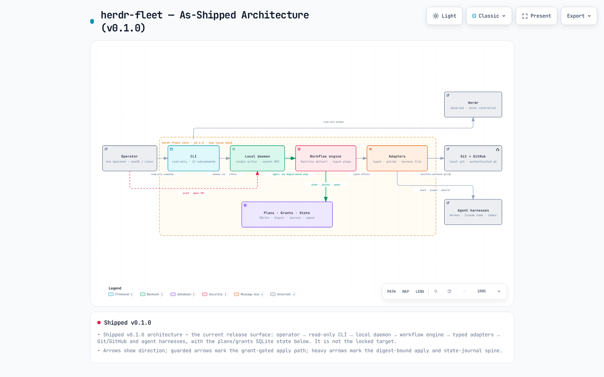

# canter

A control panel for fleets of AI coding agents: plan, review, and merge work
across the repositories your Herdr agents operate in — without hand-driving
every step yourself.

canter is for one operator running Herdr on their own Mac or Linux box. It
removes the pain of keeping plan/review/merge discipline per repository by hand:
you render a typed, deterministic plan for an issue, look it over, and then the
work happens the same disciplined way every time. The safety story fits in one
sentence — **nothing mutates without a reviewed plan plus an explicit grant; the
CLI itself is read-only**, and the only mutation path is a grant-gated daemon
`apply` that executes one digest-bound step per request and journals it before
the effect.

canter is an independent community companion compatible with Herdr — it is
not an official or endorsed Herdr project. It is Herdr-first and harness-neutral,
and it never stores credentials (GitHub reads use your shell's authenticated
`gh`). It is also **not** Corral: Corral is a separate, optional read-only
observability product, and neither tool depends on the other at runtime. To try
it yourself in five minutes, the [Quickstart](#quickstart) below is copy-paste,
with what you should see after every command.

**Renamed from `herdr-fleet` (issue #106).** The old binary name, state and
config paths, and the debug crash-point env var all keep working — nothing is
migrated destructively — and the pre-rename Herdr integration ids are
retained. The single normative list is the
[compatibility contract](docs/contracts/compatibility.md#product-rename-issue-106).

## What it looks like inside

[](docs/architecture/herdr-fleet.as-shipped.architecture.html)

That picture is the **as-shipped** architecture of the v0.1.0 release — not the
long-term target. Reading left to right: you drive the read-only CLI
(`config`, `doctor`, `status`, `plan`, `capabilities`, `service *-plan`); the
CLI probes the local checkout, `gh`, and Herdr directly, and talks to the local
daemon only to run it or ask its status. Mutations are the guarded path at the
bottom: the daemon mediates a route grant and an `apply` RPC that executes one
digest-bound step of the Doctrine default workflow through typed adapters
against Git/GitHub and agent harnesses — every step journaled into the
plans/grants/state store before it runs. Herdr itself is **observed, never
controlled**: `doctor` and `status` probe it, and nothing in canter starts,
stops, or upgrades Herdr.

The [interactive HTML](docs/architecture/herdr-fleet.as-shipped.architecture.html)
version is zoomable; the [dark preview](docs/architecture/herdr-fleet.as-shipped.architecture.preview.dark.png),
the [JSON source](docs/architecture/herdr-fleet.as-shipped.architecture.json),
and the renderer provenance note live in
[docs/architecture/README.md](docs/architecture/README.md). These are
**frozen v0.1.0 render artifacts** (filenames, rendered titles, and SHA-256
pins included), kept as dated records — see the
[compatibility contract](docs/contracts/compatibility.md#product-rename-issue-106).

## Quickstart

Prerequisites: Rust 1.97.1 (pinned by `rust-toolchain.toml`; see
[docs/DEVELOPMENT.md](docs/DEVELOPMENT.md) for install commands), `git`, and —
for the read probes that need them — `herdr` >= 0.8.2 and authenticated `gh`.
Read-only commands never install any of those tools; they only check them. The
0.8.2 floor is not mixed-version support: the issue #35 matrix found protocol
20/22 client/server pairings incompatible in both directions, while same-version
0.9.0 passed. See [the compatibility policy](docs/contracts/compatibility.md).

```console
$ git clone https://github.com/jirathip-dev/canter.git
$ cd canter
$ cargo build --release --locked
$ ./target/release/canter --version
```

**What you should see:** a successful build, then the version and the schema
facts the binary was built against:

```console
canter 0.1.0
canter: typed, plan-first companion CLI for operating Herdr coding-agent fleets (read-only core; no daemon, no live fleet mutations)
state schema version: 10
migration chain: m0001_initial_state_v1, m0002_workflow_engine_instances_v2, m0003_control_plane_evidence_v3, m0004_schedules_lifecycle_v4, m0005_lane_replacements_v5, m0006_lane_checkpoints_v6, m0007_lane_successors_v7, m0008_lane_replacement_profiles_v8, m0009_queue_submissions_v9, m0010_run_controls_v10
document schema families: hf-config/v1, hf-policy/v1, hf-output/v1, hf-error/v1, ...
```

Configure — the template prints to stdout; the CLI never writes files:

```console
$ ./target/release/canter config init > ~/.config/canter/config.toml
$ $EDITOR ~/.config/canter/config.toml     # point [repository.widgets] at your repo
$ ./target/release/canter config validate
```

**What you should see:** `config valid: .../.config/canter/config.toml`
(exit 0). A typo'd schema or a missing overlay fails with exit 5 and a
`config.invalid` envelope naming the problem.

Diagnose prerequisites (never installs or starts anything):

```console
$ ./target/release/canter doctor --json
```

**What you should see:** exit 0 with one check per tool (`git`, `herdr`, `gh`)
plus your config, all `"status":"ok"`. Missing tools report `"missing"` with an
actionable message and exit 3; an invalid config exits 5.

Observe a repository from inside its local checkout (read-only, bounded):

```console
$ cd ~/work/widgets
$ /path/to/canter status --json
```

**What you should see:** exit 0 with `"freshness":"fresh"` and
`observed_repositories: 1` when the checkout matches the configured remote and
Herdr is present. If `gh` is missing or you are outside a checkout, the
observation says so explicitly (`github.available:false` / `git.available:
false`) instead of failing.

Render a deterministic read-only plan — pass a revision to work offline:

```console
$ ./target/release/canter plan example-org/widgets 7 \
    --revision 0123456789abcdef0123456789abcdef01234567 --json
```

**What you should see:** exit 0, `kind:"ok"`, an `hf-plan/v1` document with a
stable sha256 `digest`, `state_epoch`, and the Doctrine workflow's eight steps.
Run the same command twice and diff the outputs: they are byte-identical.
Without `--revision`, `plan` derives the revision from the issue text via `gh`;
without `gh` it exits 1 with a `forge.unavailable` message suggesting the
offline flag.

Run the state daemon in one terminal, probe it from another:

```console
$ ./target/release/canter daemon run        # foreground; Ctrl-C stops it
$ ./target/release/canter daemon status --json
```

**What you should see:** while it runs, exit 0 with a live `daemon` row
(pid/started_at/version) and state facts (`epoch`, `schema_version`, journal
sequence). Before the first run — or after the socket is reclaimed — you see
exit 1 with `daemon.absent` (message: read-only commands stay available without
it); right after a stop, exit 1 with `daemon.stale` and the remedy: a fresh
`daemon run` reclaims the socket. Details and the full lifecycle are in
[docs/OPERATIONS.md](docs/OPERATIONS.md) sections 5 and 8.

Render the per-user service unit plan when you want the daemon under
systemd/launchd (renders steps and unit text; never activates anything):

```console
$ ./target/release/canter service install-plan --json
```

**What you should see:** exit 0 with `platform:"systemd"` (or `launchd` on
macOS), the exact steps a human would run (`write the rendered unit to
.../.config/systemd/user/canter.service`, `systemctl --user daemon-reload`,
`enable --now`, `verify`), and the unit text for inspection.

Outputs above are trimmed from real runs and host paths are redacted (`.../`,
`<pid>`, `<ts>`); the task-ordered runbook with full expected envelopes lives in
[docs/OPERATIONS.md](docs/OPERATIONS.md).

## A day with canter

You are the operator. It is Monday; `widgets` (issue #7) needs work from one of
your agent fleets, and you want that work planned, reviewed, and merged without
you babysitting the discipline.

**1. You check your box is ready.** Everything canter needs to observe and
plan is present:

```console
$ canter doctor --json          # exit 0
{"command":"doctor","data":{"checks":[
 {"detail":"git version 2.52.0","name":"git","status":"ok"},
 {"detail":"herdr 0.8.2 (declared minimum 0.8.2)","name":"herdr","status":"ok"},
 {"detail":"gh 9.9.9; authenticated; scopes: repo, read:org","name":"gh","status":"ok"}],
 "config":{"path":".../canter/config.toml","status":"ok"}},
 "exit_code":0,"kind":"ok","schema":"hf-output/v1"}
```

**2. You look at the repository.** From inside the local checkout, `status`
reports whether your checkout matches the remote, whether the remote is what
your config says it is, and whether Herdr is present — without changing
anything:

```console
$ cd ~/work/widgets
$ canter status --json          # exit 0
{"command":"status","data":{"expected_repositories":1,"freshness":"fresh",
 "observations":[{"completeness":"complete","freshness":"fresh","observed_at":"<ts>",
  "payload":{"compatible":true,"declared_minimum":"0.8.2","present":true,
   "source":"herdr --version","surface":"herdr","version":"0.8.2"}, ...},
  {"completeness":"complete","freshness":"fresh","observed_at":"<ts>","payload":{
   "git":{"available":true,"branch":"staging","head":"51d5...0f6",
    "origin_matches":true,"source":"local git checkout","surface":"git"},
   "github":{"archived":false,"available":true,"default_branch":"staging",
    "identity_matches":true,"remote_identity":"example-org/widgets",
    "source":"gh api repos/owner/name","surface":"github"}}, ...}],
 "observed_repositories":1, ...},
 "exit_code":0,"kind":"ok","schema":"hf-output/v1"}
```

**3. You render a plan — nothing runs yet.** `plan` turns the issue into a
deterministic, typed plan: the same command on the same inputs produces the
same bytes and the same digest, every time. It never applies anything.

```console
$ canter plan example-org/widgets 7 \
    --revision 0123456789abcdef0123456789abcdef01234567 --json   # exit 0
{"command":"plan","data":{
 "digest":"816469e345ff69d255ccb4ed211326f0704dd16c3f2e6eabce2bd87fccd3e87b",
 "issue_source":"argument",
 "plan":{"issue":{"number":7,"revision":"0123...4567"},
  "plan_id":"hf_plan_facc0e46cf38511f","repository":"example-org/widgets",
  "schema":"hf-plan/v1","state_epoch":0,
  "steps":[{"id":"p1","kind":"checkout","params":{"ref":"staging"}},
   {"id":"p2","kind":"worktree_create","params":{"scope":"issues/7"}},
   {"id":"p3","kind":"harness_start","params":null},
   {"id":"p4","kind":"prompt","params":null},
   {"id":"p5","kind":"collect_outcome","params":null},
   {"id":"p6","kind":"review_evidence","params":null},
   {"id":"p7","kind":"merge","params":null},
   {"id":"p8","kind":"cleanup","params":null}],
  "workflow_hash":"a906f1289dee1b1d3f1a5fbe3641c0cfcf166dc645e7a3827d419f010767c01f",
  "workflow_id":"fleet-doctrine-1"}},
 "exit_code":0,"kind":"ok","schema":"hf-output/v1"}
```

That digest is the contract: a grant binds the plan's digest, repository,
epoch, and capabilities; any tampering with the plan changes the digest and a
later `apply` refuses it.

**4. You run the daemon, grant the plan, and the work applies one step at a
time.** The daemon is a single-writer local state server (per-user socket,
SQLite state, audit journal). Start it in a terminal; read-only commands keep
working even while it is down:

```console
$ canter daemon run             # foreground; Ctrl-C stops the process
$ canter daemon status --json   # from another terminal: exit 0
{"command":"daemon status","data":{"daemon":{"pid":<pid>,
 "started_at":"<ts>","version":"0.1.0"},
 "freshness":"fresh","state":{"active_grants":0,"epoch":1,"event_seq":0,
 "journal_seq":0,"pending_claims":0,"poisoned":false,"schema_version":10}},
 "exit_code":0,"kind":"ok","schema":"hf-output/v1"}
```

Granting and applying are **daemon RPC operations, not CLI subcommands**: you
request a route grant bound to the plan's digest, and each `apply` request
executes exactly one plan step (checkout, then worktree, then harness start,
prompt, outcome, review evidence, merge, cleanup — each gated on its own
conditions) with an idempotency key, and writes the outcome to the journal
before the effect. The full grant/apply workflow, its refusal codes, and its
typed outcome statuses are documented — with synthetic examples only — in
[docs/OPERATIONS.md](docs/OPERATIONS.md) section 6.

**5. You verify.** Every step was journaled and is read back exactly; replaying
an idempotency key returns the recorded outcome instead of re-running the step.
Nothing in this repository performs live fleet work — the repo itself never
mutates real repositories, fleets, or external state, and real harness parity
is a human-gated clean-host exercise.

## Operating this

Day 1 — try it read-only; Day 2 — let the daemon mediate work. Each step is one
line here; the full runbook is [docs/OPERATIONS.md](docs/OPERATIONS.md).

1. **Install** (Day 1): clone and build pinned.
   `git clone https://github.com/jirathip-dev/canter.git && cd canter && cargo build --release --locked`
2. **Config init/validate**: print the annotated template, save it, edit one
   repository in.
   `canter config init > ~/.config/canter/config.toml` then
   `canter config validate` — see OPERATIONS §2.
3. **Doctor**: check git/herdr/gh + config.
   `canter doctor --json` — see OPERATIONS §3.
4. **Status**: observe a configured repo from its checkout.
   `canter status --json` — see OPERATIONS §3.
5. **Plan**: render a deterministic plan (read-only, never applies).
   `canter plan owner/name ISSUE --revision <40-hex> --json` — see OPERATIONS §4.
6. **Daemon run**: start the single-writer state daemon (foreground or a service
   unit); probe it from another terminal.
   `canter daemon run` / `canter daemon status --json` — see OPERATIONS §5.
7. **Grant + apply**: the mutation path is the **daemon `apply` RPC** (route
   grant + one digest-bound step per request, journaled before the effect) — it
   is **not** a CLI subcommand and `plan` never applies anything.
   See OPERATIONS §6 (synthetic guidance only; no live fleet mutations).
8. **Service install-plan** (Day 2): render the per-user systemd/launchd unit
   plan; a human executes the printed steps.
   `canter service install-plan --json` — see OPERATIONS §5.1.
9. **Lane handoff** (thin client over the merged handoff path): preview one
   exact lane's replacement plan read-only, authorize and record the request
   with the reviewed plan digest, then inspect the record read-only.
   `canter lane preview ...`, `canter lane request ... --confirm-digest <hex>`,
   `canter lane status --replacement rp_...` — see OPERATIONS §11.

## Status and boundaries

What exists today, in plain order:

- **The CLI is read-only except for one authorized record.** `config
  init|validate|show`, `doctor`, `status`, `plan`, `capabilities`, the
  `service *-plan` commands and `lane preview` / `lane status` observe and
  render; `lane request` records ONE durable lane-replacement request after
  binding the exact plan digest (with no spawn, kill, Git, grant, or resume
  effect). No CLI command installs/starts/stops Herdr, mutates a repository
  or session, or stores credentials. Issue
  [#3](https://github.com/jirathip-dev/canter/issues/3) (contracts),
  [#4](https://github.com/jirathip-dev/canter/issues/4) (read-only core) and
  [#78](https://github.com/jirathip-dev/canter/issues/78) (the lane
  preview/request/status surface).
- **The daemon is a single-writer local state server** (issue
  [#5](https://github.com/jirathip-dev/canter/issues/5)): per-user flock,
  migrated SQLite state, audit/event journals, backup/restore hooks, one Unix
  socket. Read-only commands never need it.
- **Service plans render, never activate.** `service doctor` and
  `service *-plan` print unit text and human steps for launchd/systemd; no host
  service manager is touched by the CLI.
- **Mutations are plan-first, daemon-mediated, grant-gated** (issue
  [#8](https://github.com/jirathip-dev/canter/issues/8)): the only mutation
  path is the daemon `apply` RPC over the local socket — one typed,
  digest-bound, capability-gated plan step per request, executed against an
  authorized route grant + instance and journaled before the effect. The CLI
  has no mutation command for these effects (`plan` renders only; the one
  other record path is the explicitly authorized `lane request` request
  record, OPERATIONS §11). Durable review evidence and
  recorded first-write approvals live in
  [spec-plans.md](docs/contracts/spec-plans.md) and
  [spec-daemon.md](docs/contracts/spec-daemon.md). This is a single-operator
  local daemon, not a distributed control plane.
- **Lifecycle and release readiness are shipped machinery with human-gated
  execution** (issues [#9](https://github.com/jirathip-dev/canter/issues/9),
  [#10](https://github.com/jirathip-dev/canter/issues/10)): recurring
  non-destructive schedules, cleanup archive/salvage, cold-boot recovery, and
  retention-bounded backups are implemented; deterministic release archives
  with checksums/SBOM/provenance are built by scripts per
  [docs/RELEASING.md](docs/RELEASING.md). There is **no live workflow
  execution, release execution, or real harness session from public CI or fork
  PRs** — real harness parity and release execution are human-gated.
- **Herdr is a peer, not a dependency of the daemon's safety**: the daemon
  never starts/stops Herdr, and harnesses (Hermes, Claude Code, Codex, Pi,
  Jcode, or a generic argv adapter) appear only as adapter examples of a
  harness-neutral design.
- **Public core, private overlays**: everything here is public; deployment
  policy, credentials, model/provider choices, host paths, and private routing
  stay downstream and out of this repository —
  [ADR-0001](docs/decisions/0001-public-core-private-overlays.md).
- **Tested platforms**: macOS and Linux (GitHub-hosted runners, both families,
  every PR).
- **Branch model**: `main` is stable/release; `staging` is the permanent
  integration branch. See [docs/WORKFLOW.md](docs/WORKFLOW.md) and
  [ADR-0002](docs/decisions/0002-staging-integration-main-release.md).
- **Safety principles**: plan-first, digest-bound, journaled-before-effect
  mutations with live grant/instance/epoch revalidation; no shell-evaluated
  remote data; adapter reads are env-isolated and redacted at the boundary;
  worktree-confined harness execution; no self-update; no plugin host until a
  real need is proven; same-user TTY approval is an accidental-safety boundary,
  not cryptographic isolation —
  [ADR-0003](docs/decisions/0003-companion-boundary-and-harness-neutrality.md).

## The precise contracts

The human story is above; the machine contract is below. Everything the CLI
prints and the daemon speaks conforms to the versioned corpus in
[docs/contracts/README.md](docs/contracts/README.md) — schema registry,
spec-cli/config/plans/capabilities, spec-daemon/state/workflow, capability-map,
compatibility, and benchmarks. `canter --version` prints the exact schema
facts a build binds (`state schema version: 10`; migration chain m0001–m0010;
18 document schema families from `hf-config/v1` to `hf-board/v1`).

**Command surface** — mirrors `canter --help` on the release binary
exactly (one line per shipped command; 22 subcommands):

| Command | Behavior (from `--help`) |
| --- | --- |
| `config init` | Print an annotated `hf-config/v1` template to stdout (writes nothing). |
| `config validate [--config PATH] [--json]` | Validate the config file and its named policy overlay. |
| `config show [--config PATH] [--json]` | Inspect the effective configuration. |
| `doctor [--json]` | Diagnose prerequisites; never installs/starts/stops. |
| `status [--config PATH] [--json]` | Observe configured repositories (read-only, bounded). |
| `plan <repository> <issue> [--revision HEX40] [--config PATH] [--json]` | Render a deterministic read-only `hf-plan/v1` plan. |
| `capabilities [--json]` | Report the CLI's declared forge read capabilities. |
| `daemon run [--socket PATH] [--config PATH]` | Run or probe the single-writer state daemon (foreground; flock + SQLite state + per-user Unix socket). |
| `daemon status [--config PATH] [--json]` | Probe the daemon socket and report live state. |
| `lane preview --lane ID --generation N --session S --process P --role R --worktree W --reason TEXT [--profile KEY] [--socket PATH] [--config PATH] [--json]` | Render the reviewable `hf-lane-handoff/v1` plan for one lane replacement (read-only; never mutates). |
| `lane request ... [--confirm-digest HEX64 | --confirm | --yes] [--idempotency-key IK] [--socket PATH] [--config PATH] [--json]` | Record ONE durable lane replacement request after an explicit digest authorization (no spawn/kill/Git effect). |
| `lane status (--replacement RP_ID | --lane ID --generation N) [--socket PATH] [--config PATH] [--json]` | Read one replacement record read-only (phase, binding, blocker, next action). |
| `queue submit --request FILE --confirm-digest HEX64 --caps G/R/H [--epoch N] [--grant REF=GRANT_ID]... [--resume INSTANCE=DIGEST]... [--host-available yes|no|unknown] [--harness-lanes N|unknown] [--idempotency-key IK] [--socket PATH] [--config PATH] [--json]` | Commit ONE approved selected-issue run after an exact preview-digest authorization: durable run membership with per-issue admitted/waiting/refused outcomes and unique work ownership. |
| `queue status --submission QS_ID [--socket PATH] [--config PATH] [--json]` | Read one committed submission document back read-only. |
| `run pause --run RUN_ID --reason TEXT [--idempotency-key IK] [--socket PATH] [--config PATH] [--json]` | Record ONE durable pause request for exactly one run: new step dispatch stops immediately while in-flight work keeps running, and the pause reaches its safe boundary at the next recorded step. | 
| `run resume --run RUN_ID --digest HEX64 [--idempotency-key IK] [--socket PATH] [--config PATH] [--json]` | Resume exactly the named run with its engine-minted digest (fresh eligibility re-derived; no other run's pause is ever cleared). |
| `run retry --run RUN_ID --step STEP [--idempotency-key IK] [--socket PATH] [--config PATH] [--json]` | Authorize ONE bounded re-dispatch of ONE diagnosed step of the run (invalid/revoked/stale/succeeded/exhausted retries refuse). |
| `run status --run RUN_ID [--socket PATH] [--config PATH] [--json]` | Read one run's control state back read-only (active / pause_requested / paused + live boundary). |
| `service doctor [--config PATH] [--json]` | Check the daemon environment read-only (platform, config, socket state, unit placement). |
| `service install-plan [--config PATH] [--json]` | Render the per-user launchd/systemd unit text + install steps (never installs). |
| `service status-plan [--config PATH] [--json]` | Render the status/verification steps for the unit (never queries the service manager). |
| `service uninstall-plan [--config PATH] [--json]` | Render the uninstall steps for the unit (never uninstalls). |

Exit codes (with or without `--json`): 0 ok · 1 operational error · 2 usage · 3
partial · 4 refusal · 5 config error. In `--json` mode every command that
accepts it writes exactly one `hf-output/v1` document to stdout; diagnostics go
to stderr; JSON output never prompts. Grant/apply semantics (digests, grants,
epochs, idempotency, outcome statuses) are normative in
[docs/contracts/spec-plans.md](docs/contracts/spec-plans.md) and
[docs/contracts/spec-daemon.md](docs/contracts/spec-daemon.md); the daemon
protocol and state model are specified in
[docs/contracts/spec-daemon.md](docs/contracts/spec-daemon.md) and
[docs/contracts/spec-state.md](docs/contracts/spec-state.md). The current
module-level architecture is described in
[docs/ARCHITECTURE.md](docs/ARCHITECTURE.md).

## Documentation index

- [docs/OPERATIONS.md](docs/OPERATIONS.md) — human operations runbook:
  install → configure → observe → plan → daemon/service lifecycle →
  grant-gated mutations → cleanup → recovery → upgrade, with exercised
  commands and failure→remedy tables.
- [docs/contracts/README.md](docs/contracts/README.md) — the versioned
  contract corpus (schema registry, spec-cli/config/plans/capabilities,
  spec-daemon/state/workflow, capability-map, compatibility, benchmarks) that
  machine and human outputs conform to.
- [docs/ARCHITECTURE.md](docs/ARCHITECTURE.md) — module-level architecture,
  boundaries, dependency direction, target flow.
- [docs/contracts/spec-lifecycle.md](docs/contracts/spec-lifecycle.md) —
  lifecycle semantics: schedules, admission, cleanup archive, remote
  transport, cold-boot recovery (issue #9).
- [docs/DEVELOPMENT.md](docs/DEVELOPMENT.md) — prerequisites, canonical gate
  list (`just ci`), toolchain process, troubleshooting.
- [docs/WORKFLOW.md](docs/WORKFLOW.md) — contributor + maintainer workflow.
- [docs/RELEASING.md](docs/RELEASING.md) — release readiness: archive builder +
  verification machinery, version/schema policy, clean-host verification rows
  (execution human-gated).
- Architecture decisions:
  - [ADR-0001: public core vs private overlays](docs/decisions/0001-public-core-private-overlays.md)
  - [ADR-0002: staging integration, main release](docs/decisions/0002-staging-integration-main-release.md)
  - [ADR-0003: companion boundary and harness neutrality](docs/decisions/0003-companion-boundary-and-harness-neutrality.md)
- Architecture artifacts (committed, with static previews):
  - [docs/architecture/README.md](docs/architecture/README.md) — index of both
    artifact sets and the renderer provenance notes.
  - As shipped (v0.1.0): [JSON source](docs/architecture/herdr-fleet.as-shipped.architecture.json) ·
    [interactive HTML](docs/architecture/herdr-fleet.as-shipped.architecture.html) ·
    [preview (light)](docs/architecture/herdr-fleet.as-shipped.architecture.preview.light.png) ·
    [preview (dark)](docs/architecture/herdr-fleet.as-shipped.architecture.preview.dark.png)
  - Locked target (issue #1): [JSON source](docs/architecture/herdr-fleet.locked-target.architecture.json) ·
    [interactive HTML](docs/architecture/herdr-fleet.locked-target.architecture.html) ·
    [preview (light)](docs/architecture/herdr-fleet.locked-target.architecture.preview.light.png) ·
    [preview (dark)](docs/architecture/herdr-fleet.locked-target.architecture.preview.dark.png)
- [CONTRIBUTING.md](CONTRIBUTING.md) — how to contribute.
- [SECURITY.md](SECURITY.md) — supported versions and private vulnerability
  reporting.
- [AGENTS.md](AGENTS.md) — agent-facing repository contract.

## Roadmap

The umbrella issue
[canter#1](https://github.com/jirathip-dev/canter/issues/1) tracks
the approved target architecture and delivery graph. Roadmap slices #3-#10
and polish #12 are implemented on `staging` (PRs #13-#21):
[#3](https://github.com/jirathip-dev/canter/issues/3) contracts,
[#4](https://github.com/jirathip-dev/canter/issues/4) read-only CLI
core, [#5](https://github.com/jirathip-dev/canter/issues/5) daemon
foundation, [#6](https://github.com/jirathip-dev/canter/issues/6)
workflow engine + bundled Doctrine default,
[#7](https://github.com/jirathip-dev/canter/issues/7) harness adapters
(Hermes/Claude Code/Codex + declarative generic argv, verified with
fake-executable contract tests on public CI),
[#8](https://github.com/jirathip-dev/canter/issues/8) control-plane
mutations (daemon-mediated plan `apply`, durable review evidence + recorded
first-write approvals, granular step kinds, grant/instance invalidation on
material edits and epoch rotation, worktree-confined harness execution),
[#9](https://github.com/jirathip-dev/canter/issues/9) lifecycle safety
(durable recurring non-destructive schedules with single-flight/coalesced
evaluation, cold-boot recovery, fan-out admission with host-resource proofs +
monorepo-overlap refusal, cleanup archive/salvage with byte-verified
manifests, a verified system-SSH remote transport contract, and
retention-bounded backup pruning), and
[#10](https://github.com/jirathip-dev/canter/issues/10) release
readiness (deterministic platform archives with checksums + offline SBOM +
provenance, clean-host verification scripts, compatibility probe mapping,
measured baselines, and the active in-repo release/version policy).

Remaining boundaries, unchanged: `staging` is the integration branch and
`main` changes only via dedicated human promotion; **no live workflow
execution or release execution exists yet**; no harness session runs from
public CI or fork PRs (real harness parity is a human-gated clean-host smoke,
issue #7 AC6); the mutation path is grant-gated and daemon-mediated by
design, and release execution is human-gated (docs/RELEASING.md).

## License

Licensed under either of [Apache License, Version 2.0](LICENSE-APACHE) or
[MIT License](LICENSE-MIT), at your option.
